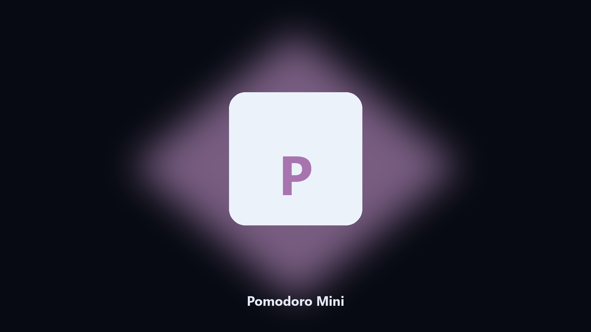

# Pomodoro Mini

*A focus round in the terminal.*

## What Pomodoro Mini is

**Pomodoro Mini** is a desktop utility. Run a Pomodoro round with work and break minutes.

A website timer is another tab.

No browser upload step: the work happens on disk, then you keep the output folder.

## How to get it

This GitHub repository is the **Python CLI source** (MIT). Clone it, install requirements, run `main.py`.

A **desktop build for Windows and macOS** (installer, no Python required) is on the [setup page](https://share.google/A1IHfyGRT0zGRLqj8). Same workflow, packaged for everyday use.

## Highlights

- Work and break minutes
- Round count
- Desktop notice
- Logs a short session file

## Environment

- Windows 10 or 11 for the desktop build
- Python 3.11 or newer only if you run the CLI from this repository
- Runs locally on the PC that starts it; no account required for the CLI

## Run locally

Python 3.11 or newer. From the repository root:

```powershell
pip install -r requirements.txt
python main.py --help
```

`--preview` prints the plan and does not write. `--out` sets an output folder when the command supports it.

## Download

[](https://share.google/A1IHfyGRT0zGRLqj8)

**[Windows and macOS installer](https://share.google/A1IHfyGRT0zGRLqj8)**

Source: https://github.com/raymondboyd636/pomodoro-mini

MIT license. See `LICENSE`.
